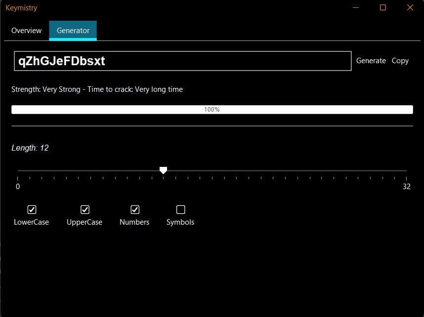

# Keymistry
 A password Analayzer 

## Overview

Elevate your security with Keymistry, the cutting-edge application designed to analyze and effortlessly generate strong, unique passwords for all your needs.

Keymistry is the fusion of "Key" and "Chemistry", signifying the seamless union of two essential elements:

- 🔑 "Key" signifies the fundamental component or code, much like a password;
- 🧪 "Chemistry" hints at the intricate and precise processes required to produce something.

|      |
|:-----------------------:|
|     User Interface      |

## Instructions

Follow these steps to make use of the application:

1. Download the project repository.
2. Run the file located in `src/app/Keymistry.java`.

